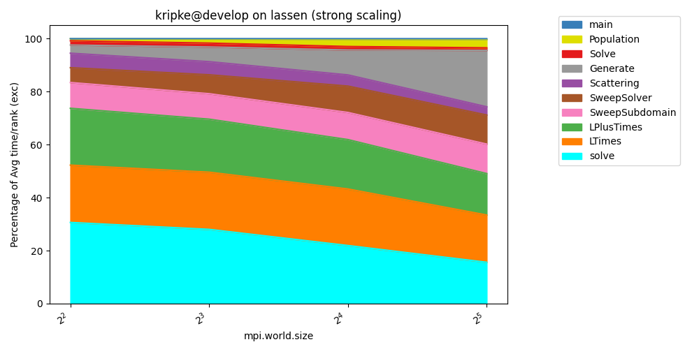
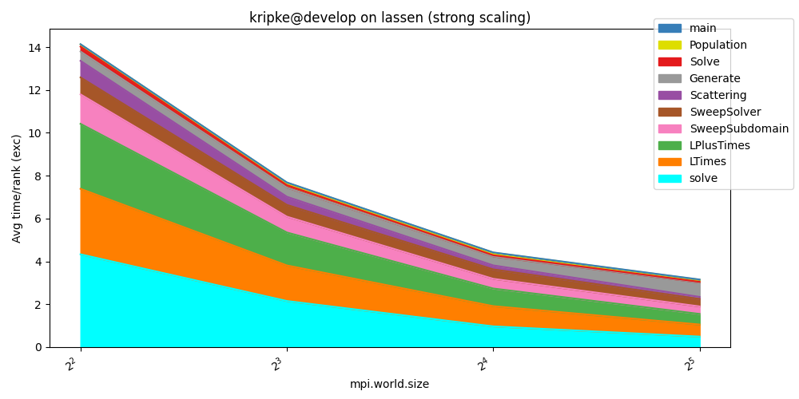
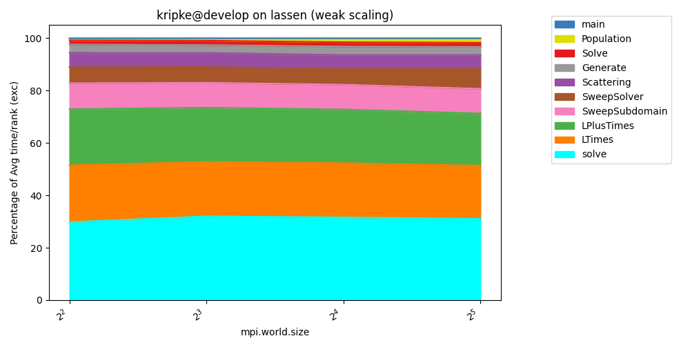
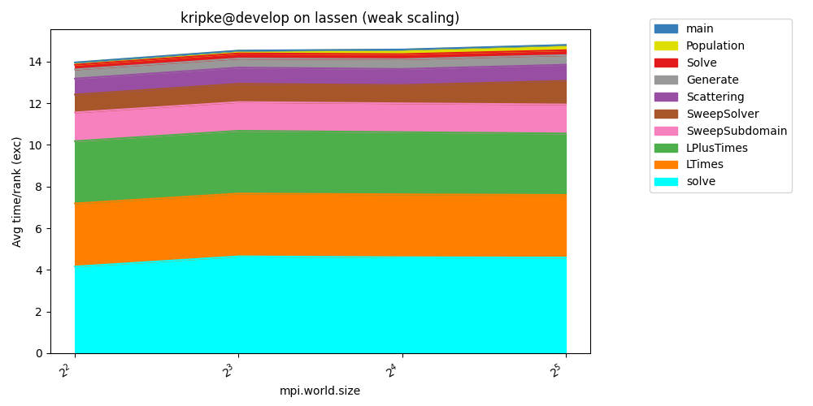
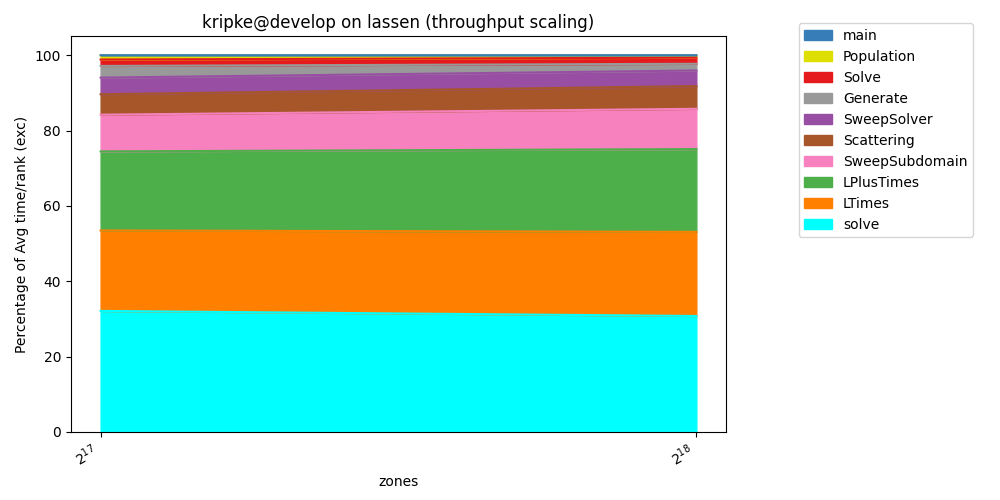
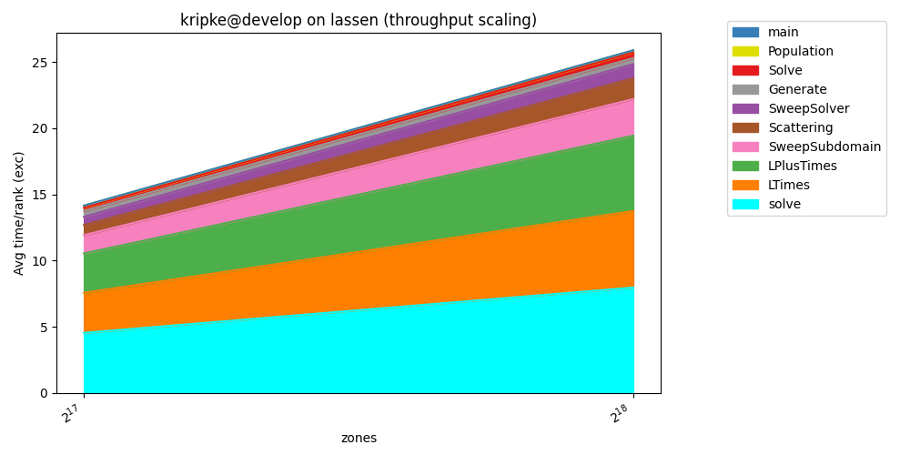

..
   Copyright 2022 Lawrence Livermore National Security, LLC and other
   Thicket Project Developers. See the top-level LICENSE file for details.

   SPDX-License-Identifier: MIT

#####################################
1. Stacked Charts for Scaling Studies
#####################################

Thicket can be used to help display the scaling behavior of an application.
In thicket/examples/python_scripts/ the python scripts provide examples
for how to generate stacked line charts.
The script is intended to help generate visualizations of scaling studies
using Caliper and Thicket.
It outputs a stacked line chart of Caliper node runtimes, either by
percentage or by run time.

Running the Script:
*******************

.. code:: console

   $ python stacked_line_charts.py <arguments>

Script Arguments:
*****************
.. list-table:: Table of Arguments
   :widths: 50 50
   :header-rows: 1

   * - Argument
     - Description
   * - --input_files
     - Str: Required. Directory of Caliper file input, including all subdirectories.
   * - --x_axis_unique_metadata
     - Str: Required. Parameter that is varied during the experiment.
   * - --chart_type
     - Str: Required. Specify type of output chart. Choices: "percentage_time" | "time".
   * - --y_axis_metric
     - Str: Optional. Metric to be visualized. Default is "Avg time/rank (exc)".
   * - --filter_nodes_name_prefix
     - Str: Optional. Filters only entries with prefix to be included in the chart.
   * - --group_nodes_name
     - Bool: Optional. Specify if nodes with the same name are combined. Default is True.
   * - --top_n_nodes
     - Int: Optional. Filters only top n longest time entries to be included in the chart. Default is -1 (no filter).
   * - --chart_title
     - Str: Optional. Title of the output chart.
   * - --chart_xlabel
     - Str: Optional. X-axis label of the chart.
   * - --chart_ylabel
     - Str: Optional. Y-axis label of the chart.
   * - --chart_file_name
     - Str: Optional. Output chart file name.
   * - --chart_figsize
     - List of Ints: Optional. Size of the output chart (xdim, ydim). Example: `--chart_figsize 10 5`.
   * - --chart_fontsize
     - Int: Optional. Font size of the output chart.

Kripke Example Output Charts:
*****************************

Strong
------

Generate the Strong dataset:

.. code:: console

  $ benchpark experiment init --dest=kripke/cuda/strong kripke+cuda+strong~single_node caliper=time
  $ benchpark system init --dest=lassen llnl-sierra
  $ benchpark setup kripke/cuda/strong lassen/ wkp
  // Follow ramble instructions ...

Run canned analysis:

.. code:: console

  $ python stacked_line_charts.py \
    --input_files "kripke-strong" \
    --x_axis_unique_metadata "mpi.world.size" \
    --chart_type "percentage_time" \
    --y_axis_metric "Avg time/rank (exc)" \
    --top_n_nodes 10

.. code:: console

   $ python stacked_line_charts.py \
    --input_files "kripke-strong" \
    --x_axis_unique_metadata "mpi.world.size" \
    --chart_type "time" \
    --y_axis_metric "Avg time/rank (exc)" \
    --top_n_nodes 10

Weak
----

Generate the Weak dataset:

.. code:: console

  $ benchpark experiment init --dest=kripke/cuda/weak kripke+cuda+weak~single_node caliper=time
  $ benchpark setup kripke/cuda/weak lassen/ wkp
  // Follow ramble instructions ...

Run canned analysis:

.. code:: console

   $ python stacked_line_charts.py \
    --input_files "kripke-weak" \
    --x_axis_unique_metadata "mpi.world.size" \
    --chart_type "percentage_time" \
    --y_axis_metric "Avg time/rank (exc)" \
    --top_n_nodes 10

.. code:: console

   $ python stacked_line_charts.py \
    --input_files "kripke-weak" \
    --x_axis_unique_metadata "mpi.world.size" \
    --chart_type "time" \
    --y_axis_metric "Avg time/rank (exc)" \
    --top_n_nodes 10

Throughput
----------

Generate the Throughput dataset:

.. code:: console

  $ benchpark experiment init --dest=kripke/cuda/throughput kripke+cuda+throughput~single_node caliper=time
  $ benchpark setup kripke/cuda/throughput lassen/ wkp
  // Follow ramble instructions ...

Run canned analysis:

.. code:: console

   $ python stacked_line_charts.py \
    --input_files "kripke-throughput" \
    --x_axis_unique_metadata "zones" \
    --chart_type "percentage_time" \
    --y_axis_metric "Avg time/rank (exc)" \
    --top_n_nodes 10

.. code:: console

   $ python stacked_line_charts.py \
    --input_files "kripke-throughput" \
    --x_axis_unique_metadata "zones" \
    --chart_type "time" \
    --y_axis_metric "Avg time/rank (exc)" \
    --top_n_nodes 10

