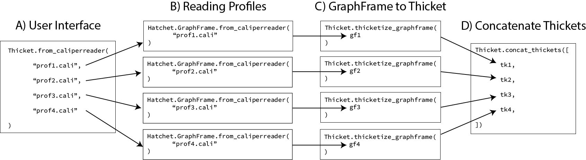

..
   Copyright 2022 Lawrence Livermore National Security, LLC and other
   Thicket Project Developers. See the top-level LICENSE file for details.

   SPDX-License-Identifier: MIT

***************************
 Concatenating Thickets
***************************

Thicket does **not** implement any native profile readers (meaning readers that read performance profiles directly into Thicket objects). All readers used in Thicket use Hatchet readers to read each performance profile into a :code:`Hatchet.GraphFrame` (Fig 1B), which is then converted to a :code:`Thicket.Thicket` object containing one profile using the :code:`Thicket.thicketize_graphframe()` function (Fig 1C). The one profile Thickets are then concatenated into a single Thicket object using the :code:`Thicket.concat_thickets()` function (Fig 1D), which is capable of concatenating a set of n Thickets, T:

.. math::
    T = \{t_1, t_2, ..., t_n\}

where each :math:`t_i` (:math:`i = 1, 2, ..., n`) has number of profiles :math:`p_i >= 1`.

    Figure 1: Example of the Thicket reader process for 4 Caliper profiles.

|

The process of concatenating Thickets requires the unification of some structures like the :code:`Thicket.graph` (calltree), which is explained below.

##################
Unifying Thickets
##################

This section mainly refers to the :code:`Thicket.Ensemble._unify()` function.

===================
Unifying Calltrees
===================

*Unifying Calltrees* is the process of performing a **graph operation** (e.g. :code:`Hatchet.graph.union()`) on multiple :code:`Thicket.graph`'s. Comparing two graphs involves comparing :code:`Hatchet.Node` objects between the graphs.  The :code:`Hatchet.graph.union()` function computes the union graph between two Hatchet graphs. For the union, nodes are compared by:

1. `Their depth in the tree <https://github.com/LLNL/hatchet/blob/6a6d7027056df96bd1c919ab34a9acce81f3b9a1/hatchet/graph.py#L247>`_ - :code:`Node._depth`.
2. `Their frame <https://github.com/LLNL/hatchet/blob/6a6d7027056df96bd1c919ab34a9acce81f3b9a1/hatchet/graph.py#L248>`_ ("name" and "type") - :code:`Node.frame._tuple_repr` 

Nodes that match in #1 and #2 are merged in the resulting union graph as a new :code:`Hatchet.Node` object (`deep copy of the first node <https://github.com/LLNL/hatchet/blob/6a6d7027056df96bd1c919ab34a9acce81f3b9a1/hatchet/graph.py#L227>`_). Deep copies of nodes that do **not** match are inserted into the union graph at the appropriate depth.

*Note:* Comparing nodes with the equality operator (:code:`==`) is not sufficient, as the equality operator only compares the :code:`Node._hatchet_nid`, which is not the same as the above comparison.

*Note:* The :code:`Thicket.intersection()` function first applies the :code:`Hatchet.graph.union()` before computing the intersection of the graphs, since their does not exist a :code:`Hatchet.graph.intersection()` function.

======================
Updating Node Objects
======================

Because Node objects must be identical between Thicket components (see :ref:`/thicket_properties.rst#nodes`), The resulting new nodes in the union graph must replace the old node objects in components like the :code:`Thicket.dataframe.index` (see `code <https://github.com/LLNL/thicket/blob/develop/thicket/ensemble.py#L68-L83>`_). The :code:`Hatchet.graph.union()` function provides a dictionary mapping old nodes to new nodes, however to avoid applying these updates after every union between two graphs, we `update a dictionary of all the node mappings <https://github.com/LLNL/thicket/blob/develop/thicket/ensemble.py#L53-L67>`_ and apply the updates after all of the unions have been computed. This is **only** necessary when concatenating more than **two** Thickets, as only one union will be performed when concatenating two Thickets. We `apply this idea when reading files <https://github.com/LLNL/thicket/blob/develop/thicket/thicket.py#L393-L413>`_ to avoid this cost.

####################
Index Concatenation
####################

*Index Concatenation* refers to the process that happens for the performance and metadata tables. We concatenate the tables, which is essentially "stacking the rows on top of each other". Because we check that the performance profiles we concatenate are unique (:ref:`/thicket_properties.rst#profiles`), we do not need to worry about duplicate indices in either table. We sort the index of both tables, which interleaves the profiles in the MultiIndex of the performance table to visually group all of the profiles in the table for each node. An example of this operation can be seen in the :ref:`/thicket_tutorial.ipynb`, when :code:`axis="columns"`.

#####################
Column Concatenation
#####################

*Column Concatenation* refers to the process that happens in the performance, metadata, and statistics tables. We create a MultiIndex out of the columns, such that for each metric, there is a higher level index label. An example of this operation can be seen in the :ref:`/thicket_tutorial.ipynb`, when :code:`axis="columns"`.