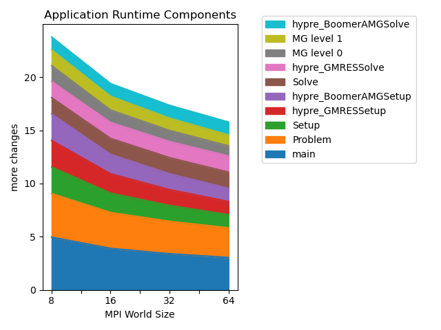

..
   Copyright 2022 Lawrence Livermore National Security, LLC and other
   Thicket Project Developers. See the top-level LICENSE file for details.

   SPDX-License-Identifier: MIT

*****************
Analysis Examples
*****************

Scaling Studies
===============

.. literalinclude:: ../examples/python_scripts/stacked_line_graphs.py
    :language: python

To run the script
.. code:: console

  $ python stacked_line_graphs.py --input_files <input file or path> --filter_operation <mpi|top10> --out_graphs <perc|total>

Example output graph

  Scaling plot
