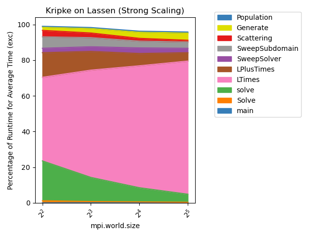
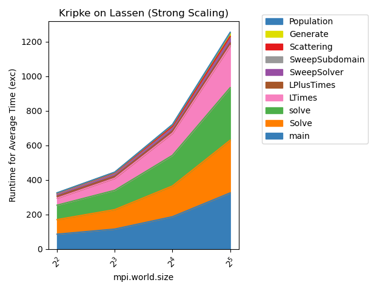
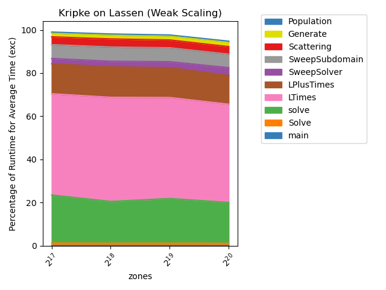
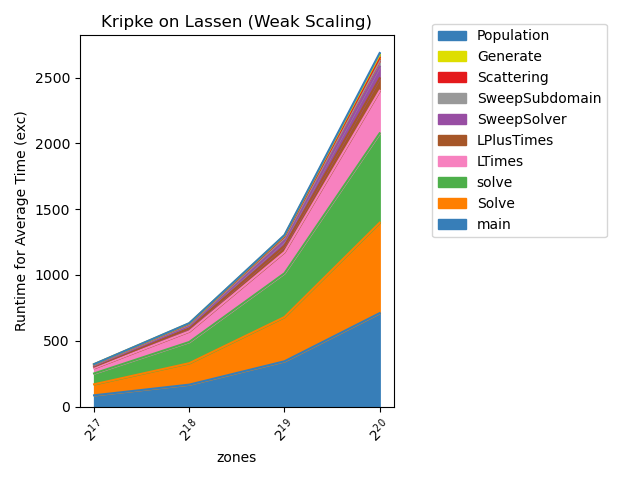

..
   Copyright 2022 Lawrence Livermore National Security, LLC and other
   Thicket Project Developers. See the top-level LICENSE file for details.

   SPDX-License-Identifier: MIT

*****************
Analysis Examples
*****************

Scaling Studies
===============

.. literalinclude:: ../examples/python_scripts/stacked_line_charts.py
    :language: python

To run the script:

.. code:: console

   $ python stacked_line_charts.py --input_files <input file or path> --groupby_parameter <parameter varied between runs> --filter_prefix <optional prefix> --top_ten <optional True|False> --out_graphs <perc|total>

Scaling Studies:

python stacked_line_charts_2.py --input_files "/usr/workspace/hao3/kripke_cuda_combo_7_29_final/kripke/cuda/LLNL-Sierra-IBM-power9-V100-Infiniband/workspace/experiments/kripke/kripke/kripke_cuda_strong*" --x_axis_unique_metadata mpi.world.size --y_axis_metric "Avg time/rank (exc)" --chart_type percentage_time --chart_title "Kripke on Lassen (Strong Scaling)" --chart_file_name kripke_cuda_strong_perc --chart_ylabel "Percentage of Runtime for Average Time (exc)" --x_axis_scaling 2 --top_n_nodes 10

python stacked_line_charts_2.py --input_files "/usr/workspace/hao3/kripke_cuda_combo_7_29_final/kripke/cuda/LLNL-Sierra-IBM-power9-V100-Infiniband/workspace/experiments/kripke/kripke/kripke_cuda_strong*" --x_axis_unique_metadata mpi.world.size --y_axis_metric "Avg time/rank (exc)" --chart_type total_time --chart_title "Kripke on Lassen (Strong Scaling)" --chart_file_name kripke_cuda_strong_tot --chart_ylabel "Runtime for Average Time (exc)" --x_axis_scaling 2 --top_n_nodes 10

python stacked_line_charts_2.py --input_files "/usr/workspace/hao3/kripke_cuda_combo_7_29_final/kripke/cuda/LLNL-Sierra-IBM-power9-V100-Infiniband/workspace/experiments/kripke/kripke/kripke_cuda_weak*" --x_axis_unique_metadata zones --y_axis_metric "Avg time/rank (exc)" --chart_type percentage_time --chart_title "Kripke on Lassen (Weak Scaling)" --chart_file_name kripke_cuda_weak_perc --chart_ylabel "Percentage of Runtime for Average Time (exc)" --x_axis_scaling 2 --top_n_nodes 10

python stacked_line_charts_2.py --input_files "/usr/workspace/hao3/kripke_cuda_combo_7_29_final/kripke/cuda/LLNL-Sierra-IBM-power9-V100-Infiniband/workspace/experiments/kripke/kripke/kripke_cuda_weak*" --x_axis_unique_metadata zones --y_axis_metric "Avg time/rank (exc)" --chart_type total_time --chart_title "Kripke on Lassen (Weak Scaling)" --chart_file_name kripke_cuda_weak_total --chart_ylabel "Runtime for Average Time (exc)" --x_axis_scaling 2 --top_n_nodes 10

