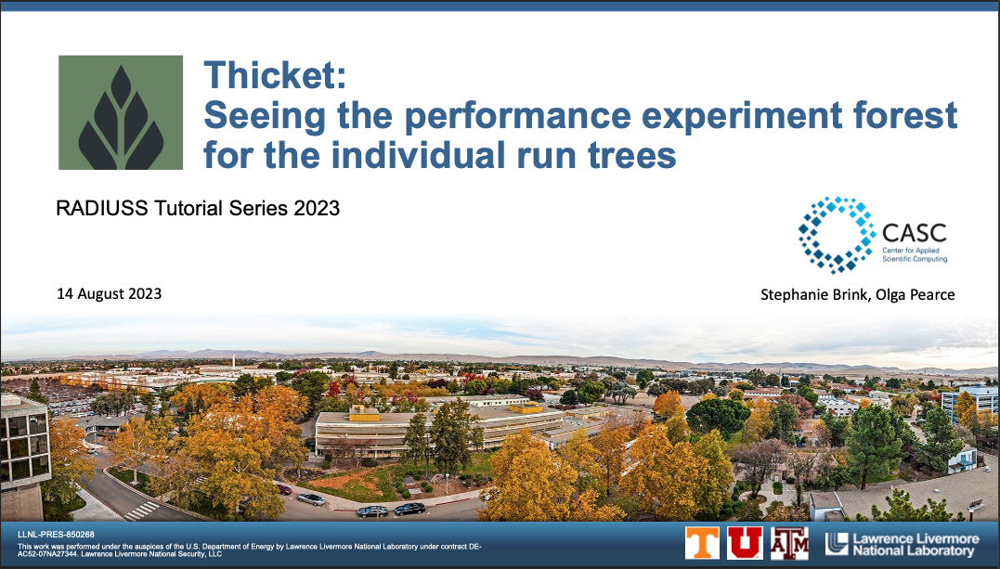

..
   Copyright 2022 Lawrence Livermore National Security, LLC and other
   Thicket Project Developers. See the top-level LICENSE file for details.

   SPDX-License-Identifier: MIT

###############################
 Tutorial Materials
###############################

This is an introduction to Thicket with a presentation and live demos. It was
presented as a virtual event at the `2023 RADIUSS Tutorial Series
<https://aws.amazon.com/blogs/hpc/call-for-participation-radiuss-tutorial-series-2023/>`_,
August 14, 2023, alongside Caliper.

:download:`Download Slides <_static/thicket-radiuss23-tutorial-slides.pdf>`.

We provide scripts that take you through some of the available features in
Thicket. They correspond to sections in the slides above.

To run through the scripts, you can follow the instructions to build the docker
image in `thicket-tutorial <https://github.com/llnl/thicket-tutorial>`_.
