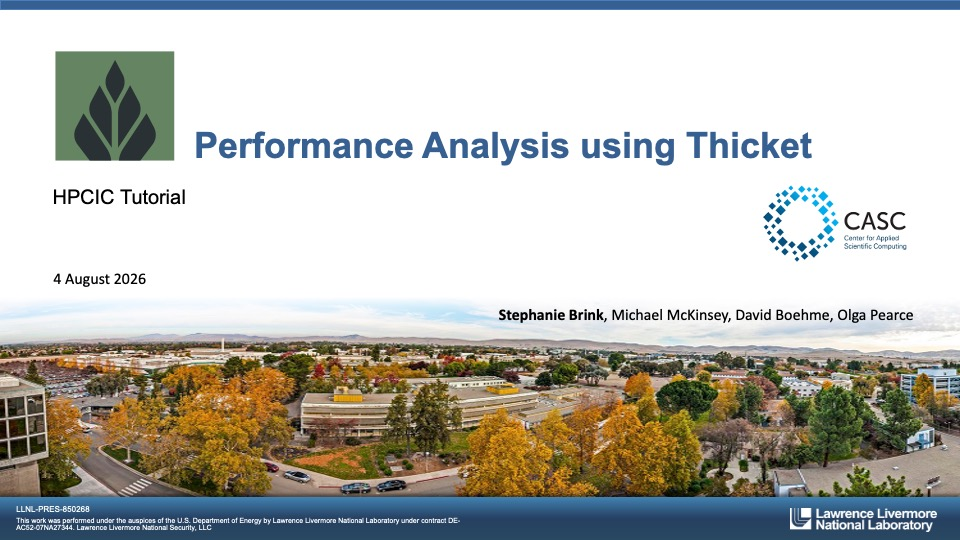

..
   Copyright 2022 Lawrence Livermore National Security, LLC and other
   Thicket Project Developers. See the top-level LICENSE file for details.

   SPDX-License-Identifier: MIT

###############################
 Tutorial Materials
###############################

This is an introduction to Thicket with a presentation and live demos. It was
presented virtually at the `HPCIC Tutorial Series <https://hpcic.llnl.gov/tutorials>`_,
August 4, 2026, alongside Caliper.

:download:`Download Slides <_static/2026_Thicket_Tutorial_HPCIC.pdf>`.

We provide an AWS instance containing Jupyter notebooks that will take you
through some of the available features in Thicket. They correspond to sections
in the slides above.
