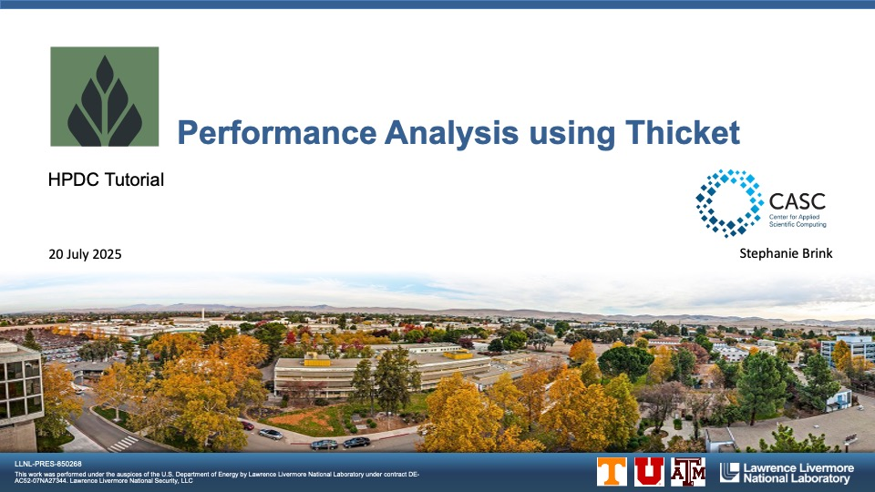

..
   Copyright 2022 Lawrence Livermore National Security, LLC and other
   Thicket Project Developers. See the top-level LICENSE file for details.

   SPDX-License-Identifier: MIT

###############################
 Tutorial Materials
###############################

This is an introduction to Thicket with a presentation and live demos. It was
presented as an in-person half-day event at the `2025 Symposium on High-Performance Parallel and Distributed Computing (HPDC) <https://hpdc.sci.utah.edu/2025/workshops.html>`_,
July 20, 2025, alongside Caliper and Benchpark.

:download:`Download Slides <_static/2025_07_20_Thicket_HPDC25_Tutorial.pdf>`.

We provide an AWS instance containing Jupyter notebooks that will take you
through some of the available features in Thicket. They correspond to sections
in the slides above.
