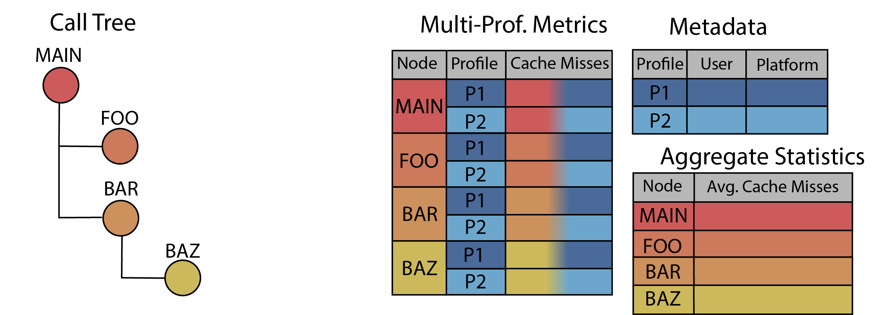
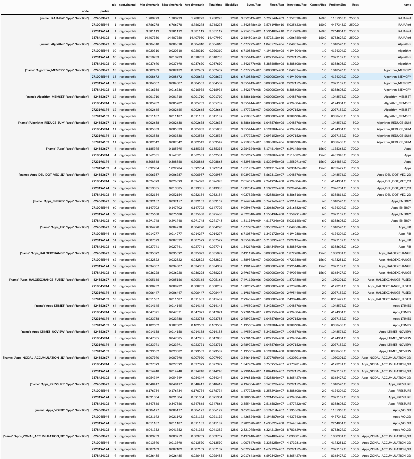
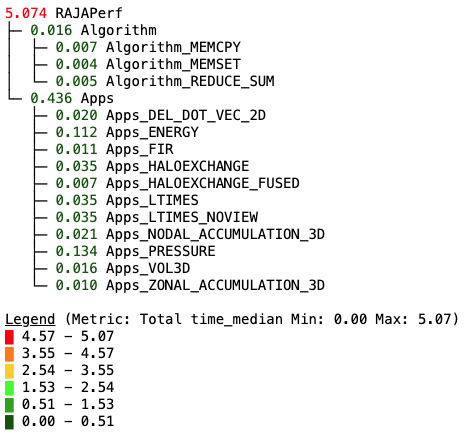
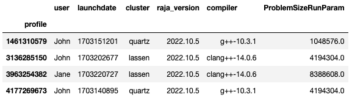
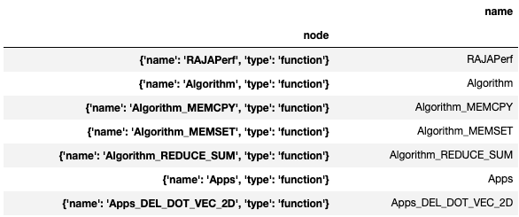
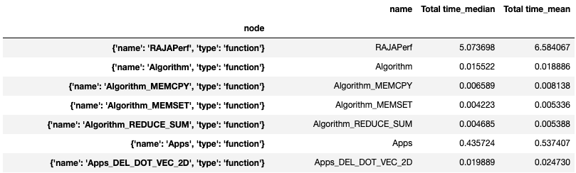

***************
User Guide
***************

Thicket Components
=======================
A thicket object is a flexible data model that enables the structured analysis of unstructured performance data. 
The four components of thicket are the call tree, performance data, metadata, and
aggregated statistics, as shown in the figure below.

  Figure 1: The four components of the thicket object.

Performance Data
=======================
The performance data table is a multi-dimensional, multi-indexed structure with one or more rows of data associated 
with each node of the call tree. Each row associated with a node of the call tree
represents a different execution of the associated call tree node. Below is an 
example of a performance data table stored in a thicket object. 

  Figure 2: Example performance data table in thicket.

|
The performance data's call tree structure can be seen below with corresponding nodes. This structure extends to both the 
performance data and aggregated statistics table.

  Figure 3: Example call tree in thicket.

|
Metadata
=======================

During Thicket construction, the available metadata about each
run is read in and composed into a metadata table.
The metadata table can contain all available information about each of the 
application runs in the thicket, 
such as batch info (the time of the run, the user),
machine information (OS, processor type, number of processors used),
build information (compiler, optimization levels),
and runtime parameters for the application.
Thicket's functionality leverages the available metadata to enable
dataset manipulation such as filtering on any of the metadata fields.

.. note::

    See the :ref:`Adiak <ref-adiak>` section in :doc:`Generating Profiling Datasets
    <generating_data>` for a description on how to enrich your profiling data with
    metadata.

  Figure 4: Example metadata table in thicket with information about each run.

|
Aggregated Statistics
=======================

The aggregated statistics table supports an order-reduction mechanism and stores processed applications’ performance. 
Each row of the aggregated statistic table holds data aggregated across all profiles associated with a particular call tree node. 
Below is an example of an empty aggregated statistics table just containing the nodes.

  Figure 5: Example of an empty aggregated statistics table in thicket.

Thicket provides users with capabilities for computing common aggregated statistics on their performance data, such as mean and standard deviation. Below is an example 
of an aggregated statistics table with appended results from a statistical calculation.

  Figure 6: Example aggregated statistics table in thicket with mean and median
  calculated on a single column (e.g., Total_time) from the performance data table.

|
